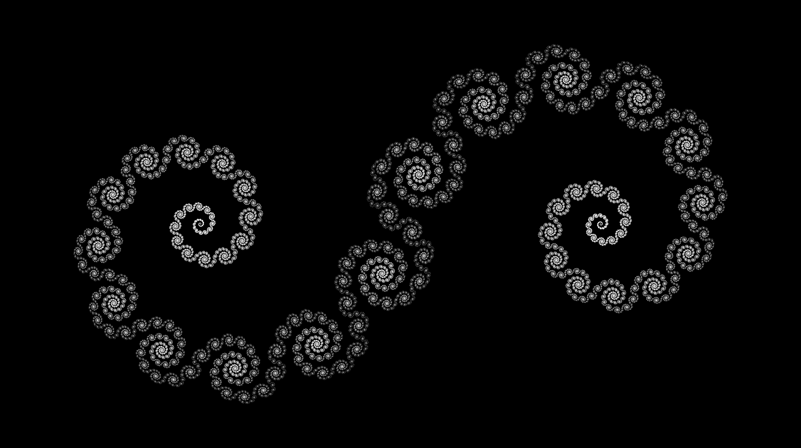
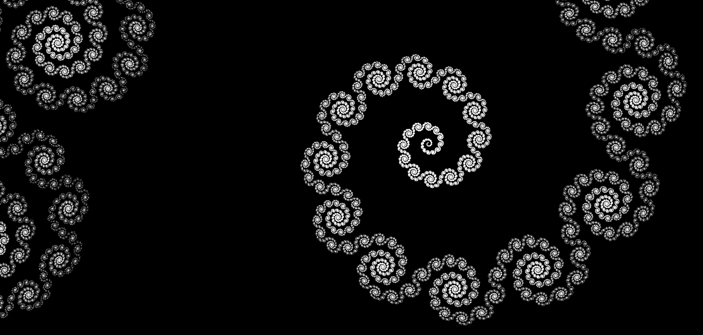

# Logarithmic-Fractal
A spiraling fractal on the complex plane.  

  
  
  
  
The basic fractal is defined as the set Zn as n tends to infinity, where -  
Zn+1 = { (2m + sgn(Re(z)) (1-e|Re(z)|(ln(k)+𝑖)) + k|Re(z)| e𝑖(|Re(z)|-arctan(ln(k)) Im(z)) | z∈Zn, m∈ℤ } ,  
Z0 = { (2m + sgn(Re(θ)) (1-e|Re(θ)|(ln(k)+𝑖)) | θ∈ℝ, m∈ℤ } ,  
k ∈ (0, 1)  
  
It is a fractal of logarithmic spirals.
